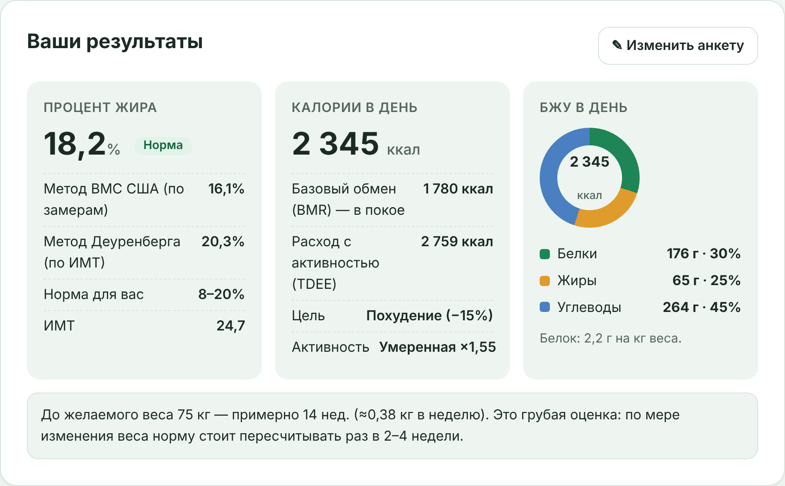

# NutriPlan AI — план питания на 30 дней

Веб-приложение, которое по анкете считает процент жира и норму КБЖУ, а затем с помощью ИИ (Claude API) составляет персональный план питания на 30 дней со списком покупок.

**Демо:** https://d0kuchaevmiha-arch.github.io/nutriplan-ai/

## Возможности

- **Пошаговая анкета из 5 шагов:** данные, замеры, цель, активность, питание. У полей есть валидация и подсказки, как правильно измерять.
- **Процент жира двумя методами:** по формуле ВМС США (по замерам) и по формуле Деуренберга (по ИМТ). Итог — их среднее и категория с учётом пола и возраста.
- **КБЖУ по формуле Миффлина — Сан-Жеора:** базовый обмен, расход с учётом активности, корректировка под цель, распределение белков, жиров и углеводов.
- **Защита от опасных целей:** норма не опускается ниже 1200 ккал для женщин и 1500 ккал для мужчин, слишком низкий желаемый вес не принимается.
- **План на 30 дней от ИИ:** собирается частями по 6 дней, с прогресс-баром. Обрезанные по длине ответы докачиваются, повторы блюд отслеживаются, после ошибки можно повторить с места сбоя.
- **Список покупок по неделям.**
- **Экспорт:** кнопки «Скопировать» и «Скачать .txt».
- **Адаптивная вёрстка** для телефона и компьютера, управление с клавиатуры.

## Технологии

Один файл `index.html`: HTML, CSS и чистый JavaScript. Без фреймворков, сборки и внешних библиотек. План питания генерируется через [Claude API](https://docs.claude.com) (Anthropic Messages API).

## Как запустить

1. Скачайте `index.html` и откройте его в браузере. Анкета и расчёты работают сразу.
2. Чтобы получить план питания, вставьте свой API-ключ Anthropic. Его можно создать в [консоли Anthropic](https://console.anthropic.com/settings/keys).

Ключ хранится только в вашем браузере и отправляется только на сервер Anthropic.

## Известные ограничения

- Для генерации плана нужен собственный API-ключ; запросы оплачиваются с аккаунта владельца ключа.
- Полный план — это 7 запросов к ИИ и обычно несколько минут ожидания.
- План не сохраняется между сессиями: перед закрытием вкладки его нужно скачать.

## Важно

Это справочный расчёт, а не медицинская рекомендация. При заболеваниях, беременности и сильном дефиците веса проконсультируйтесь с врачом.
